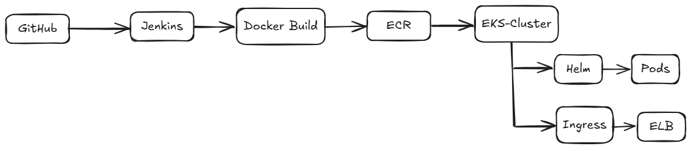

# Studify — AI-Powered Study Companion with Full DevOps Pipeline

Studify is an intelligent study assistant that transforms study materials into quizzes, summaries, and flashcards powered by **Google Gemini AI** — deployed on **AWS EKS** with a fully automated CI/CD pipeline.

---

## Architecture



```
Developer → GitHub → Jenkins → Docker Build → AWS ECR
                                                  ↓
Internet → ELB → Nginx Ingress → EKS Cluster → Pods → MongoDB Atlas
```

---

## DevOps Stack

| Tool | Purpose |
|------|---------|
| Docker | Containerization |
| Jenkins | CI/CD Pipeline |
| AWS ECR | Docker Image Registry |
| AWS EKS | Kubernetes Cluster |
| Helm | Kubernetes Package Manager |
| Nginx Ingress | Traffic Routing |
| MongoDB Atlas | Managed Database |

---

## CI/CD Pipeline

1. Developer pushes code to GitHub
2. Jenkins detects push via **webhook**
3. Version auto-incremented in `package.json` (semver)
4. Docker image built and tagged with new version
5. Image pushed to **AWS ECR**
6. **Helm** deploys to EKS with rolling update (zero downtime)
7. Updated `package.json` committed back to GitHub

Jenkins pipeline uses a **shared library** for reusable functions:
[Jenkins-Shared-Library](https://github.com/tayyabshahjahan/Jenkins-Shared-Library)

---

## Infrastructure

- **EKS Cluster** — AWS ap-south-1 (Mumbai) with Auto Mode
- **Nginx Ingress Controller** — Single entry point via AWS ELB
- **MongoDB Atlas** — Managed cloud database (no DB in cluster)
- **Jenkins** — Running on Digital Ocean droplet
- **Secrets** — Managed via Kubernetes Secrets, injected at deploy time

---

## Kubernetes Setup

```bash
# Install Nginx Ingress Controller
helm repo add ingress-nginx https://kubernetes.github.io/ingress-nginx
helm install ingress-nginx ingress-nginx/ingress-nginx \
  --namespace ingress-nginx \
  --create-namespace \
  --set controller.publishService.enabled=true \
  --set controller.service.annotations."service\.beta\.kubernetes\.io/aws-load-balancer-scheme"=internet-facing

# Deploy Studify
helm upgrade --install studify ./studifyCharts \
  --namespace studify \
  --create-namespace \
  --set image.tag=VERSION \
  --set mongoUrl=MONGO_URL \
  --set geminiApiKey=GEMINI_KEY
```

---

## App Features

- **Multi-format Upload** — PDFs, Word documents, PowerPoint presentations
- **AI Processing** — Auto-generate quizzes, summaries, and flashcards via Gemini API
- **Study Planning** — Create and manage study sessions
- **Task Tracking** — Track completed topics and filter by status
- **Authentication** — Secure login via Passport.js

---

## App Stack

| Layer | Technology |
|-------|-----------|
| Backend | Node.js, Express.js |
| Frontend | EJS, Bootstrap |
| Authentication | Passport.js |
| AI | Google Gemini API |
| Database | MongoDB Atlas |
| File Handling | Multer |

---

## Known Limitations & Planned Improvements

- **Session scaling** — Currently single replica due to in-memory sessions. Redis planned for multi-replica support
- **Monitoring** — Prometheus + Grafana planned
- **Infrastructure as Code** — Terraform planned for full infrastructure provisioning
